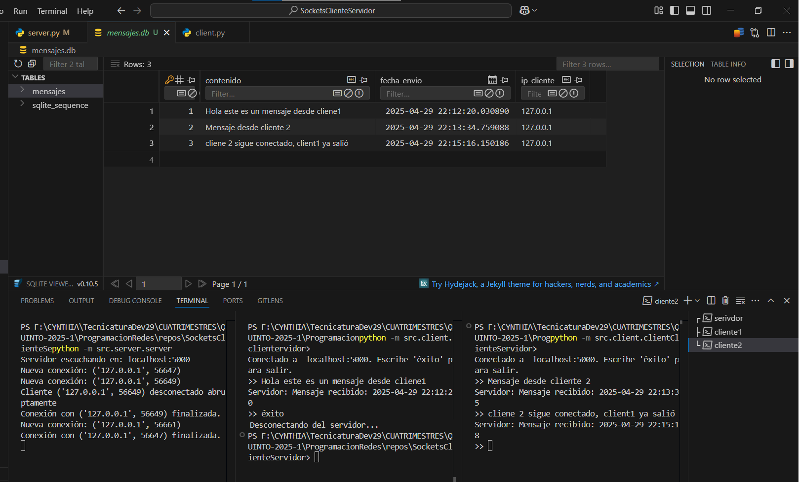

# Chat Cliente-Servidor con Sockets y SQLite

Un servidor y cliente de chat básico implementado en Python, usando sockets para la comunicación y SQLite para almacenar mensajes. El servidor maneja múltiples clientes simultáneamente con hilos.


## Características

- 🗨️ Comunicación en tiempo real entre cliente y servidor.
- 💾 Almacenamiento persistente de mensajes en base de datos SQLite.
- 🧵 Manejo de múltiples clientes con hilos.
- 🛠️ Código modular con documentación en métodos

## Estructura del Proyecto

```bash
chat-app/
├── src/
│   ├── assets/               # Capturas de pantalla/imágenes
│   │   └── chat_demo.png   # Ejemplo de comunicacion y registro en DDBB
│   │
│   ├── client/               # Módulo del cliente
│   │   ├── __init__.py
│   │   └── client.py         # Lógica del cliente
│   │  
│   ├── server/               # Módulo del servidor
│   │   ├── __init__.py
│   │   ├── server.py         # Lógica principal del servidor
│   │   ├── database.py       # Operaciones con SQLite
│   │   └── config.py         # Configuraciones (puerto, host, etc)
│   │
│   └── shared/               # Código compartido
│       ├── __init__.py
│       └── utils.py          # Funciones comunes (ej: formateo de fechas)  
│               
└── README.md         # Este archivo
```


## Requisitos

- Python 3.8 o superior
- Módulos estándar de Python: `socket`, `sqlite3`, `threading`, `datetime`

## Instalación

1. Clona el repositorio:
```bash
git clone https://github.com/CynthiDev/SocketsClienteServidor.git
```
## Uso
### Servidor

```bash
# Desde la raíz del proyecto:
python -m src.server.server
```
#### Salida esperada
```bash
Servidor escuchando en: localhost:5000
```


### Cliente
```bash
python -m src.client.client
```
#### Ejemplo de interacción cliente
```bash
>> Hola mundo
Servidor: Mensaje recibido: 2024-05-28 10:30:45

>> éxito
Desconectando del servidor...
```

## 📸 Capturas de Pantalla

| Demo cliente-servidor-DDBB |
|---------------------------|
|   |


